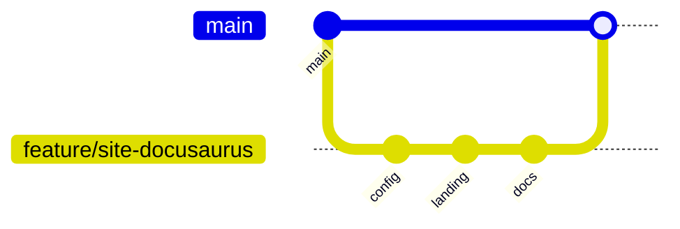

# Evidencias Git para o TP3

A avaliacao do TP3 valoriza a qualidade do uso de Git. Este repositorio ja
mostra uma evolucao por ramos e merges, com funcionalidades separadas antes de
entrarem em `main`.

## Ramos existentes

| Ramo | Objetivo |
| --- | --- |
| `feature-login` | Registo e autenticacao de utilizadores |
| `feature-eventos` | Operacoes de eventos |
| `feature-json-storage` | Persistencia em ficheiros JSON |
| `feature-oop-refactor` | Refatoracao para classes |
| `feature-setores-lotacao` | Setores e lotacao |
| `feat-dashboard-financeiro` | Indicadores de vendas |
| `refactor/project-structure` | Organizacao em services e storage |

## Fluxo recomendado para o site



## Commits sugeridos

Para demonstrar desenvolvimento faseado, uma sequencia clara seria:

1. `chore(site): scaffold docusaurus website`
2. `feat(site): add marketing landing page`
3. `docs(site): document features and installation`
4. `docs(git): add TP3 workflow evidence`
5. `style(site): polish responsive layout`

## Pull request

Uma pull request para o site pode incluir:

- resumo do objetivo;
- screenshots da homepage;
- checklist de validacao;
- referencia a issue;
- resultado de `npm run build`.

### Template curto

```md
## Objetivo
Criar o site Docusaurus para publicitar o EventFlow.

## Validacao
- [ ] npm install
- [ ] npm run build
- [ ] revisao da homepage
- [ ] revisao da documentacao

Closes #X
```

:::tip
Se houver mais do que um elemento no grupo, cada pessoa pode fazer commit num
ramo proprio ou contribuir na mesma pull request com commits assinados pelo seu
utilizador Git.
:::
